# MERN-Stack-Ecommerce-Site-CI-CD-With-GitHub-Actions
Automated Pipeline for an E-Commerce Platform

# Project Overview
This project involves automation of an Ecommerce MERN stack website, using Github Action.The application will be containerized and deployed to AWS. It will challenge your skills in developing a  three tier application and automating its deployment, offering a comprehensive understanding of CI/CD practices in a commercial setting.

MERN Web stack consists of following components:

- MongoDB: A document-based, No-SQL database used to store application data in a form of documents.

- ExpressJS: A server side Web Application framework for Node.js.

- ReactJS: A frontend framework developed by Facebook. It is based on JavaScript, used to build User Interface (UI) components.

- Node.js: A JavaScript runtime environment. It is used to run JavaScript on a machine rather than in a browser.

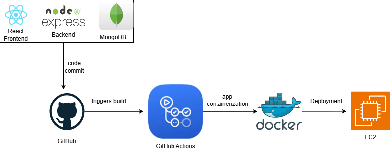


# Task 1: Project Setup
-	Create a new GitHub repository named ecommerce-platform. In your vscode or IDE, clone into the repository using the command below

```git clone https://github.com/<your-username>/ecommerce-platform.git

```

-	Inside the repository, create two directories: api for the backend and webapp for the frontend.

```
mkdir api webapp
```
    Your structure should look like this:
```
ecommerce-platform/
├── api/
└── webapp/
```
This platform has two primary components:
-	E-Commerce API: Backend service handling product listings, user accounts, and order processing.
-	E-Commerce Frontend: A web application for users to browse products, manage their accounts, and place orders.


# Task 2: Initialize GitHub Actions
-	Initialize a Git repository and add your initial project structure.
-	Create .github/workflows directory in your repository for GitHub Actions.

# Task 3: Backend(API) Setup

- **Navigate to the api directory and initialize Nodejs:**

```
cd api
npm init -y
```

- **install express and mongoose**
```
npm install express mongoose
```
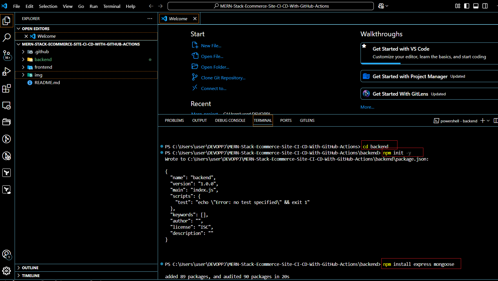

- **Install other dependencies:**

```
npm install dotenv cors express-async-handler bcryptjs jsonwebtoken
```

>>The dependencies above listed are commonly used in Node.js applications for building backend APIs. Here's a breakdown of each one:

1. **`express`**: 
   - A minimal and flexible Node.js web application framework that provides a robust set of features for web and mobile applications. It simplifies the process of setting up a server and handling routing.

2. **`mongoose`**:
   - An Object Data Modeling (ODM) library for MongoDB, providing a schema-based solution for modeling application data.
   

2. **`dotenv`**: 
   - A zero-dependency module that loads environment variables from a `.env` file into `process.env`. This is useful for managing configuration settings, such as database connection strings and API keys, without hardcoding them in your source code.

3. **`cors`**: 
   - A middleware that enables Cross-Origin Resource Sharing (CORS) in your Express application. It allows your server to accept requests from different origins, which is essential when your frontend and backend are hosted on different domains.

4. **`express-async-handler`**: 
   - A wrapper for Express middleware that makes it easier to handle asynchronous functions. It helps to catch errors in asynchronous route handlers and pass them to the Express error handler, simplifying error handling.

5. **`bcryptjs`**: 
   - A library for hashing and comparing passwords. It provides a way to securely store user passwords by hashing them, making it difficult for attackers to retrieve the original passwords even if they gain access to the database.

6. **`jsonwebtoken`**: 
   - A library for creating and verifying JSON Web Tokens (JWT). JWT is commonly used for authentication and information exchange. It allows you to securely transmit information between parties as a JSON object, which can be verified and trusted.


- **Create a server.js file and copy and paste the below code:**

```
const express = require('express');
const mongoose = require('mongoose');
const app = express();

app.use(express.json());

mongoose.connect('mongodb+srv://<username>:<password>@cluster0.mongodb.net/ecommerce?retryWrites=true&w=majority', {
  useNewUrlParser: true,
  useUnifiedTopology: true,
});

app.get('/products', (req, res) => {
  res.json([{ id: 1, name: 'Sample Product', price: 10 }]);
});

app.listen(3000, () => console.log('API running on port 3000'));
```

- **Install jest for unit testing:**

```
npm install --save-dev jest supertest
```
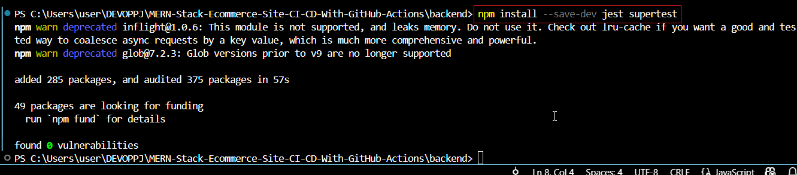

- **Create server.test.js file:**

```
const request = require('supertest');
const app = require('./server');

test('GET /products returns product list', async () => {
  const response = await request(app).get('/products');
  expect(response.status).toBe(200);
  expect(response.body).toEqual([{ id: 1, name: 'Sample Product', price: 10 }]);
});
```

- **Update your paskage.json:**

```
"scripts": {
  "test": "jest"
}
```
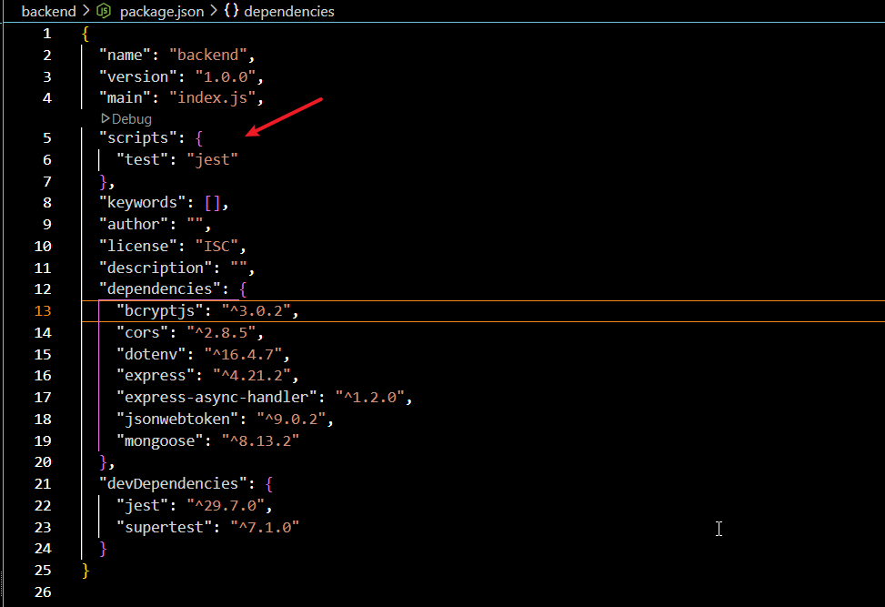


- **Create other files:**

Create other files for the backend service to include handling product listings, user accounts, and order processing. Create other directories and files as seen in this repository's backend directory example config, controllers, middleware, models, routes and utils. Also create a .env file where you will store your database connection string. 

>> Note: it is important the include your .env file in the gitignore file inother not to expose your sensitive data.


# Task 4: Setup MongoDB 

- **Sign up** at [MongoDB Atlas](https://account.mongodb.com/account/login) 
- **create a cluster:** On the home dashboard, click "cluster"> "create". Next input the name of the cluster and select the provider.

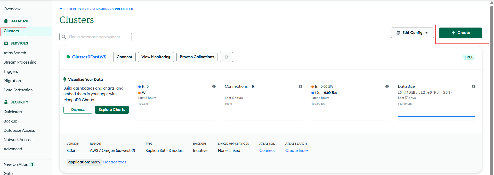

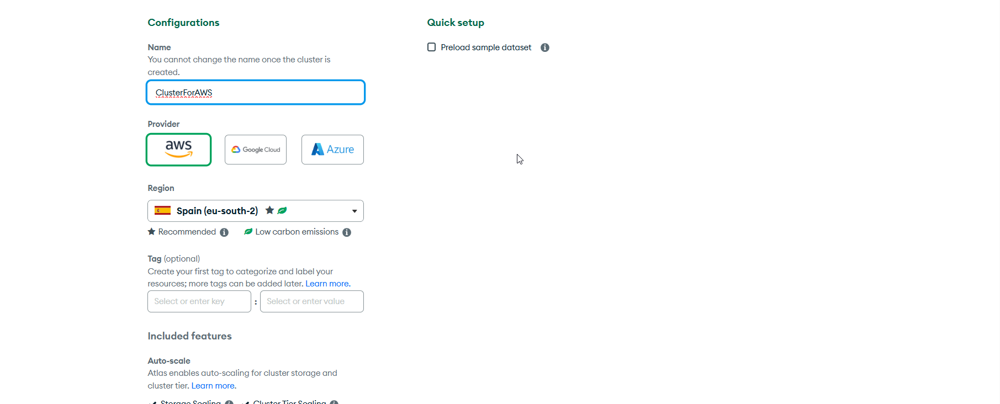

- **Create User for database access:** On the home page, click on database access and "select new database User". Choose the user's authentication method, input username and a strong password. Select role i.e user permission by clicking on "Add built-in role". select "read and write to any database" and click on add user.

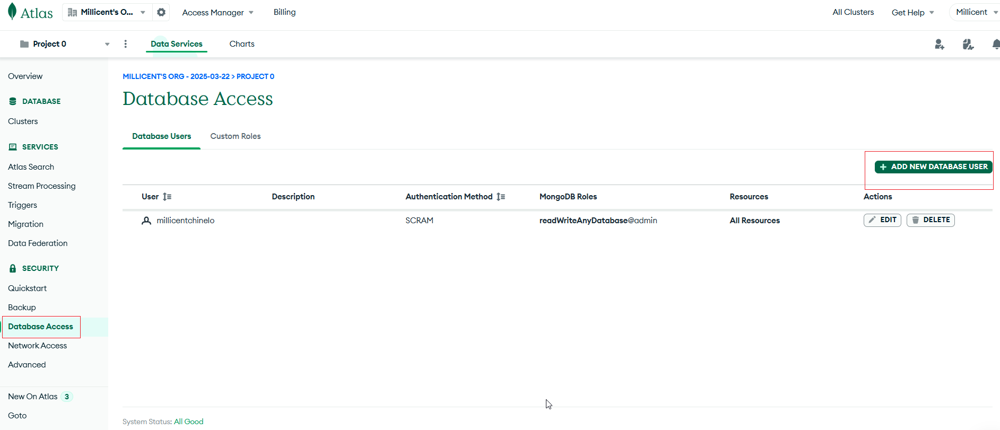

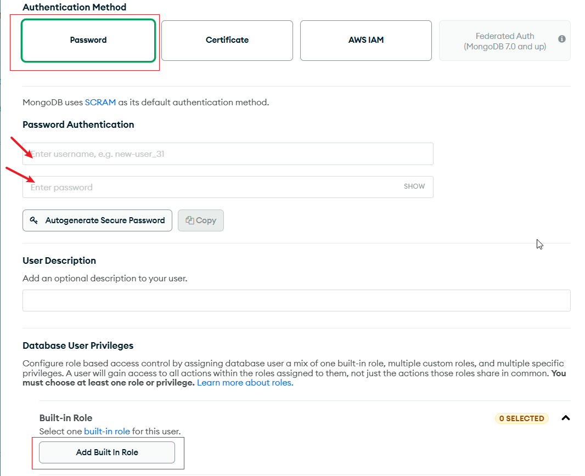

- **Add ip addresses that can access the database:**
Click on Network Access, add the ip address of your laptop since we are first deploying locally

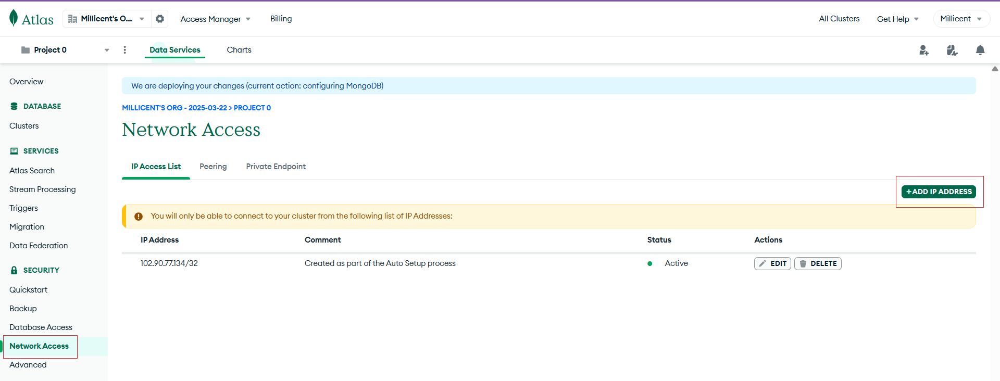

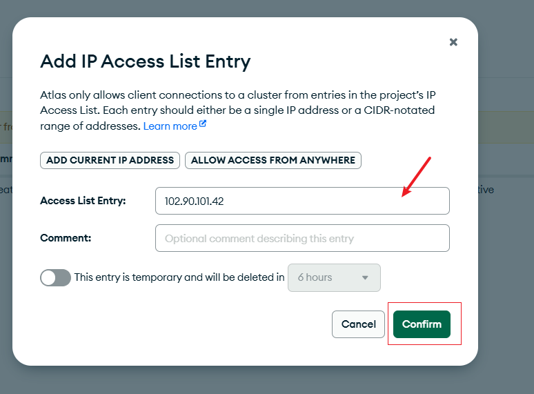

- **Get your connection string which will used to connect the backend to the database:** Navigate to your cluster and click on connect. Select your username, then copy the connection string.  Replace <dd-password> in the mongoose.connect call with your user-password.

- **Generate a random API key to use for JWT autheutication:**
Copy and paste the below command on pwershell. The PowerShell command generates a random Base64-encoded string, typically used for creating secure tokens, such as API keys or session identifiers.

```
[Convert]::ToBase64String((New-Object byte[] 32)) -replace '[^a-zA-Z0-9]', ''
```
Navigate to your .env file and Input the random value generated to be equal to JWT_SECRET.

```
JWT_SECRET=Random-value-generated
```


# Task 5: Test Backend and Database connection using postman
- Start your server using the command:
```
node server.js
```

# Task 6: Frontend Web Application Setup

- **Set Up React:** Firstly, in order not to stop the backend that is running, open an extra terminal. Navigate to webapp(frontend directory) and install React. The install might take up to 5mins depending internet strength.

```
cd ../webapp
npx create-react-app .
```
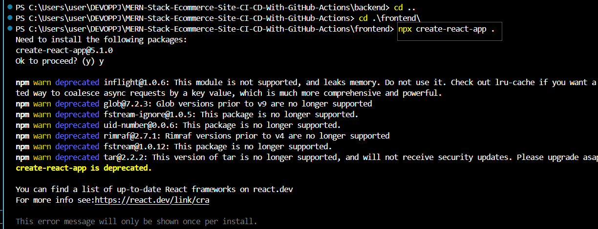

- **Install all dependencies:**

```
npm install react-bootstrap bootstrap @reduxjs/toolkit react-redux react-router-dom react-router-bootstrap axios @redux-devtools/extension redux redux-thunk reselect
```
>>Here's a brief overview of the dependencies you're installing:

1. **`react-bootstrap`**: 
   - Provides Bootstrap components as React components, allowing for easy integration of Bootstrap styles in React applications.

2. **`bootstrap`**: 
   - The core CSS framework offering styles and layout utilities for responsive web design.

3. **`@reduxjs/toolkit`**: 
   - A toolkit that simplifies Redux development, making it easier to configure the store, reducers, and middleware.

4. **`react-redux`**: 
   - Connects React components to a Redux store, enabling state management across your application.

5. **`react-router-dom`**: 
   - A routing library for React that manages navigation and renders components based on the current URL.

6. **`react-router-bootstrap`**: 
   - Integrates React Router with Bootstrap components, facilitating navigation within Bootstrap-styled components.

7. **`axios`**: 
   - A promise-based HTTP client for making API requests, simplifying data fetching and handling responses.

8. **`@redux-devtools/extension`**: 
   - An extension for Redux DevTools that allows you to inspect and debug Redux state changes in your application.

9. **`redux`**: 
   - The core library for managing application state in a predictable way through a centralized store.

10. **`redux-thunk`**: 
    - A middleware that allows action creators to return functions (thunks) instead of plain objects, enabling asynchronous actions.

11. **`reselect`**: 
    - A library for creating memoized selectors in Redux, helping to efficiently compute derived state from the Redux store.

- **Update App.js, App.css. index.js and Index.css:**
When you install react, it comes with a default app.js, app.css, index.js and index.css files in src directory. You will delete its contents and update its respective content as seen on this repository 


 **Create other files for the Ecommerce capacity:**

Create other files for the frontend web application to include features for users to browse products, manage their accounts, and place orders. Create other directories and files as seen in this repository's frontend directory example src/components, src/pages, src/redux, including the files in them.  

- **Run build**

```
npm run build
```


- **Install serve and Deploy application**
Install the serve package in other to serve pages from the specified directory

```
npm install -g serve
```
Deploy the front:
```
serve -s build
```

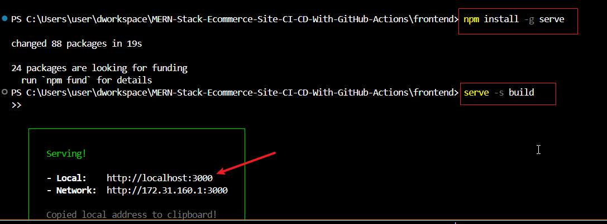

- view the website over the internet:
The application is running on port 3000, hence the application will be view at your local host at port 3000. View all page and ensure they are responsive.

```
http://localhost:3000
```
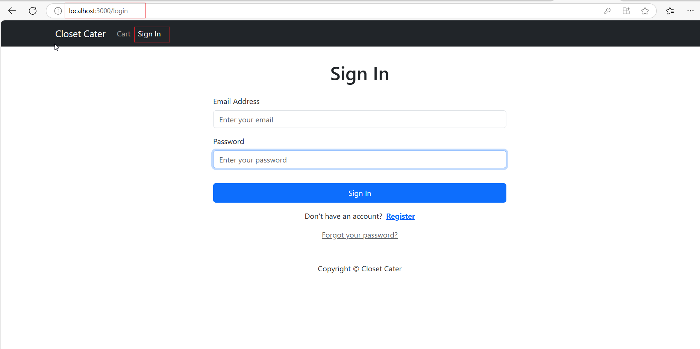
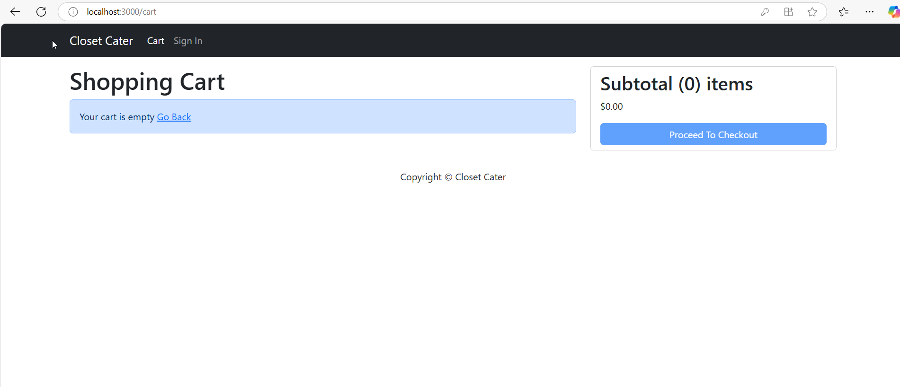
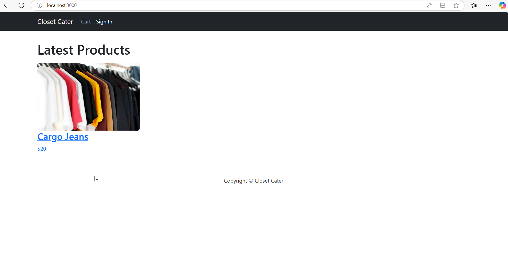
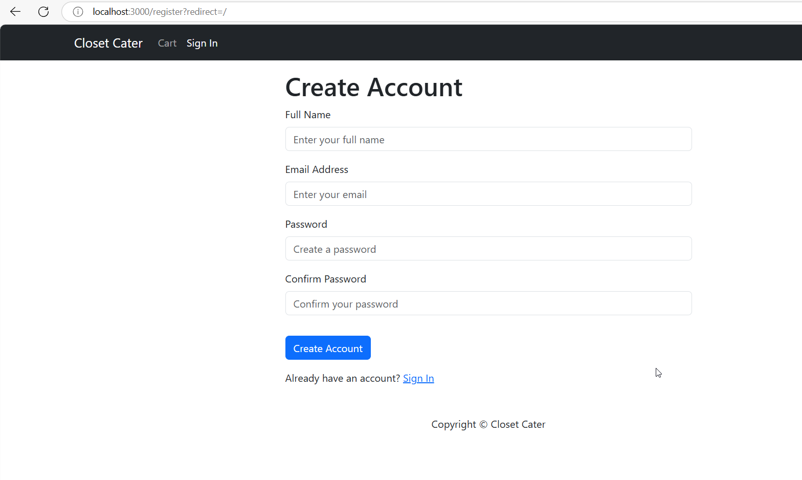

# TROUBLESHOOTING

- Database connection error: The backend could not connect to the database.

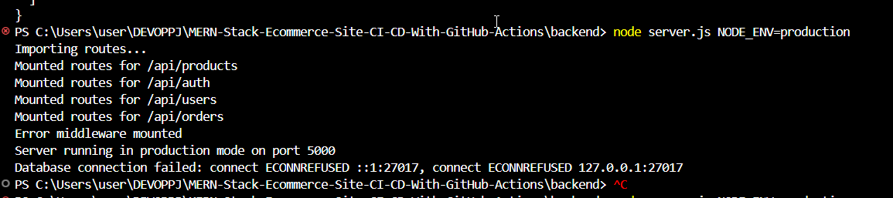

Solution: This was a permission issue. Navigate to Network access in your database and allow traffic rom your laptops ip address, when testing locally. Add your instance ip address when automating from GIthub Actions.

- Uncaught Error or Blank page:

For this error, It occurred because the dependencies installed for the frontend were higher than that of your laptop's version. It will always indicate such issue when downloading the react package or it's dependencies, hence ensure you look out if it is showing vulnerabilities, like shown in the image below.

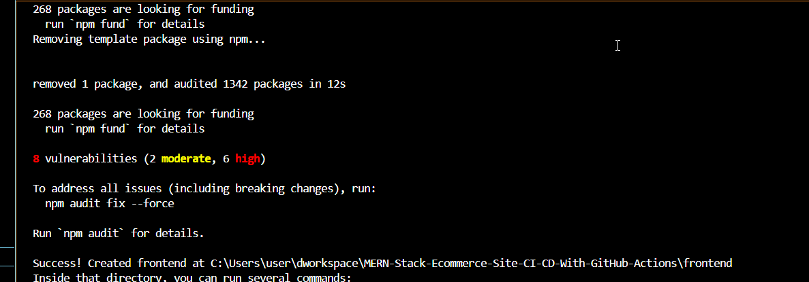


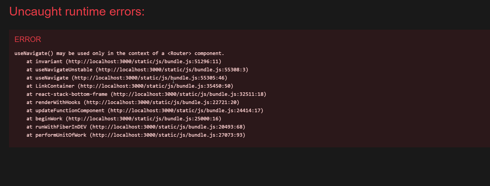


Solution:
Sometimes it will show a blank page, hence you have to make error to show on the chrome page by doing the below.

```
CTRL + SHIFT + i
```

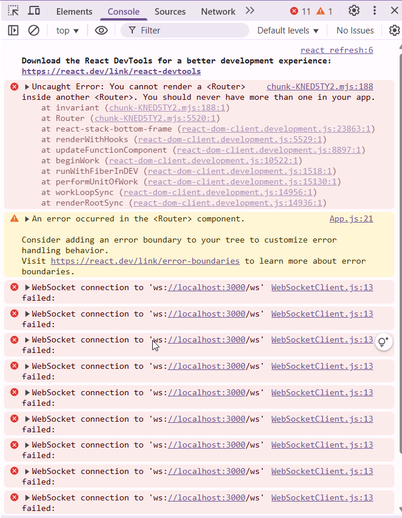

When the error shows, you can then start debugging. For this you have to check each dependencies and install the version compartible with your laptop or you delete the content of your package.son(which is where the installed dependencies are housed), then copy and paste the package.json in frontend directory of this repository.

```
{
  "name": "frontend",
  "version": "0.1.0",
  "private": true,
  "dependencies": {
    "@redux-devtools/extension": "^3.3.0",
    "@reduxjs/toolkit": "^2.6.1",
    "@testing-library/dom": "^10.4.0",
    "@testing-library/jest-dom": "^6.6.3",
    "@testing-library/react": "^16.2.0",
    "@testing-library/user-event": "^13.5.0",
    "axios": "^1.8.4",
    "bootstrap": "^5.3.3",
    "react": "^19.1.0",
    "react-bootstrap": "^2.10.9",
    "react-dom": "^19.1.0",
    "react-redux": "^9.2.0",
    "react-router-bootstrap": "^0.26.3",
    "react-router-dom": "^6.30.0",
    "react-scripts": "5.0.1",
    "redux": "^5.0.1",
    "redux-thunk": "^3.1.0",
    "reselect": "^5.1.1",
    "web-vitals": "^2.1.4"
  },
  "scripts": {
    "start": "react-scripts start",
    "build": "react-scripts build",
    "test": "react-scripts test",
    "eject": "react-scripts eject",
    "dev": "concurrently \"npm run server\" \"npm run client\"",
    "server": "NODE_ENV=test cd backend && nodemon server.js",
    "client": "cd frontend && npm start"
  },
  "eslintConfig": {
    "extends": [
      "react-app",
      "react-app/jest"
    ]
  },
  "browserslist": {
    "production": [
      ">0.2%",
      "not dead",
      "not op_mini all"
    ],
    "development": [
      "last 1 chrome version",
      "last 1 firefox version",
      "last 1 safari version"
    ]
  },
  "overrides": {
    "postcss": ">=8.4.31",
    "nth-check": ">=2.0.2"
  }
}
```
After saving the pasted content, reinstall the dependencies for the frontend using the command:

```
cd frontend
npm install
```

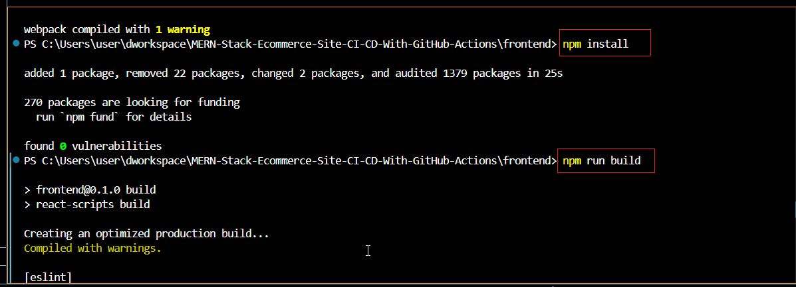

Run the frontend again:

```
serve -s build
```